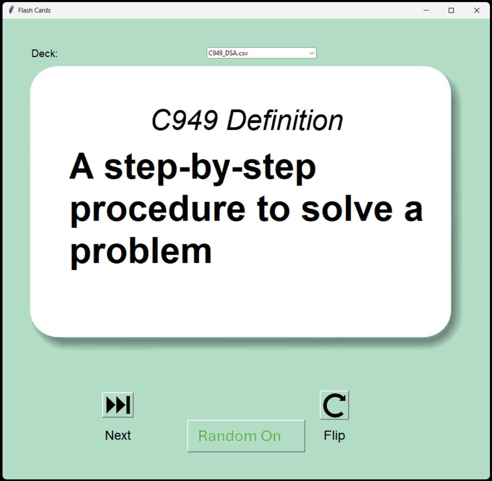

# csv-flashcard-app
A Python Tkinter flashcard app that loads study cards from CSV files.

A simple flashcard application built with Python and Tkinter that loads study decks from CSV files.

This app is designed to be flexible and easy to use for different subjects such as language learning and computer science.

---

## Features

- Load flashcards from CSV files
- Supports multiple decks
- Simple graphical interface
- Flip cards (front/back)
- Next card navigation
- Optional random mode
- Uses images for card display

---

## Included Decks

This project currently includes:

- **Spanish Flashcards**
  - Alphabet
  - Basic vocabulary (ABC, numbers, nouns)

- **Data Structures & Algorithms**
  - `C949_DSA.csv` 
  (key concepts for studying but needs editing, it was an inital template for example)

  Consider changing the order of your CSV file.
  You might actually want BOTH directions eventually:

Deck 1 (Definition → Term) best for exam
Deck 2 (Term → Definition) good for reinforcement

---

## Project Structure 
You need the main.py and .png files or the app wont work.

The CSV files are optional but no CSV files means nothing to load.

All these files need to be in the same folder.

FLASH_CARD_APP
├── main.py
├── ReadMe.txt
├── C949_DSA.csv
├── Spanish_ABC.csv
├── Spanish_CH1.csv
├── Spanish_Nouns.csv
├── Spanish_Numbers.csv
├── card_front.png
├── card_back.png
├── flip.png
├── next.png
├── Random_On.png
├── Random_Off.png

## How to Run

Make sure you have Python installed.
You may want to run main.py in VS Code.
The main.py and png files are required in the filefolder. 
You can make your own .CSV files and place them in the folder.

ChatGPT can also format the CSV file for you.  

## CSV Format

Each flashcard deck should follow this format:

Line 1 is your card header and comma placement is important.
Example:
Spanish,English
or
Definition,Term

Then the rest can be:

question,answer 

Example:

A step-by-step procedure to solve a problem,Algorithm

Hola,Hello

Uno,One

## 📸 Screenshot

---------------------------------------------------------------------------------------------
You can create your own decks by adding new CSV files.

---

## How It Works

- The app reads flashcards from a CSV file
- Displays the **question (front of card)**
- Flip button shows the **answer (back of card)**
- Next button loads a new card
- Random mode toggles shuffled cards

---

## Future Improvements

- Score tracking
- Category filtering
- Better UI styling
- Deck selection menu
- Save user progress

---

## Contributing

WGU student contributions are welcome!

Ideas:
- Add new decks
- Improve UI
- Add features (score, shuffle, tracking)
- Refactor code structure

---

## License

MIT License

